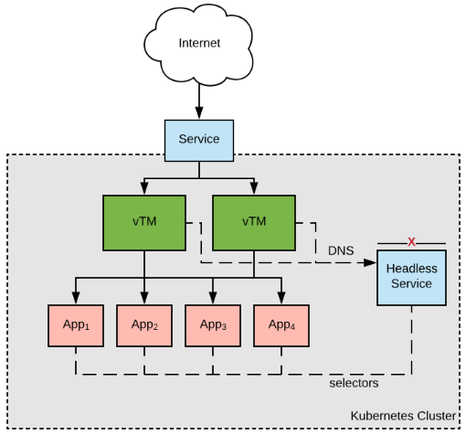

Pulse Secure Virtual Traffic Manager
===

Pulse Secure Virtual Traffic Manager (vTM) is an advanced Application Delivery Controller that can be deployed in a wide variety of private and cloud environments, including [Kubernetes](kubernetes.io) clusters, to improve performance, security and reliability of applications deployed behind it.

See the [Pulse Secure vADC landing page](https://www.pulsesecure.net/vadc) for more details on the product and its capabilities.

When deployed in Kubernetes, the traffic manager operates as a stateless application with all its configuration managed through ConfigMap and Secret resources. As such, it can be fully managed through declarative manifest files and can take advantage of Kubernetes facilities such as horizontal pod autoscaling. 

About this Repository
===
This repository contains resources to help you:
* Deploy traffic manager instances in Kubernetes
* Configure traffic manager deployments to handle ingress traffic and distribute it to the applications deployed in the cluster.

The repository offers two methods for doing this: static manifest files, and a Helm chart. You can use whichever approach best suits your workflow.

Deployment and Configuration Methods
===
The following deployment and configuration methods are supported by vTM:

Static Manifests
---
The [deploy](./deploy) section of the repository contains a standalone Kubernetes manifest file that can be used to create a traffic manager Deployment. The documentation in that section walks through how to use it and configure the deployed vTM instances to manage traffic for a sample application.

Helm Chart
---
The [helm](./helm) section of the repository contains a [Helm](https://helm.sh) chart that can be used for deploying and managing vTM instances in Kubernetes clusters where Helm is available.

Configuring vTM in Kubernetes
===

Configuration Documents
---
Most traffic manager configuration in Kubernetes is controlled through **configuration documents**.  

Configuration documents express traffic manager configuration in either JSON or YAML format, and their structure is based upon the traffic manager's REST API schema. They are processed by the Configuration Importer tool, which is included with the traffic manager from version 18.3 onwards.

Configuration documents can be placed into Kubernetes ConfigMaps (and, optionally, Secrets), and from there can be mapped into the traffic manager container's filesystem so that the Configuration Importer tool can read them. They can import data, such as TLS certificates and keys, that is not stored in the configuration document format.

The configuration document format can also be used to conveniently embed traffic manager configuration into other resources, for example in a ```values.yaml``` files used to deploy a Helm chart.

For full information on the structure of configuration documents, and guidance on how to construct and use them, see the [Pulse Secure Virtual Traffic Manager Configuration Importer Guide](https://www.pulsesecure.net/techpubs/Pulse-vADC-Solutions/Pulse-Virtual-Traffic-Manager/18.3).

<a name="lb" id="lb"></a>Load-balancing Over Application Pods
---
Rather than issuing traffic to an application's Cluster IP and relying on kube-proxy to distribute traffic between the pods that are running a particular application, the traffic manager can discover the endpoints itself, allowing it to issue traffic to them directly using its own load-balancing algorithms and use its advanced health monitoring capabilities to rapidly respond to failures.

To facilitate this, a [headless service](https://kubernetes.io/docs/concepts/services-networking/service/#headless-services) should be created for the application. The traffic manager's Service Discovery feature can then be configured to discover the pods over which it should load-balance by querying the Kubernetes DNS server for the endpoints of the headless service.



An example of how to configure the traffic manager to use the Service Discovery plugin in Kubernetes can be found in the [deploy](./deploy/) section of the repository.


Questions
===
If you have a Pulse Secure Virtual Traffic Manager license with support entitlement, please contact the Pulse Secure support team with any questions.


License
===
The files in this repository are licensed under the terms of [Apache License 2.0](./LICENSE). See the LICENSE file for details.