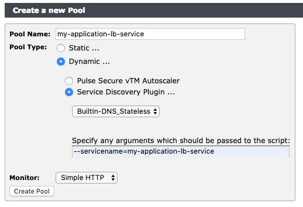
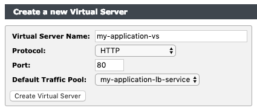
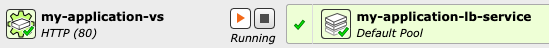
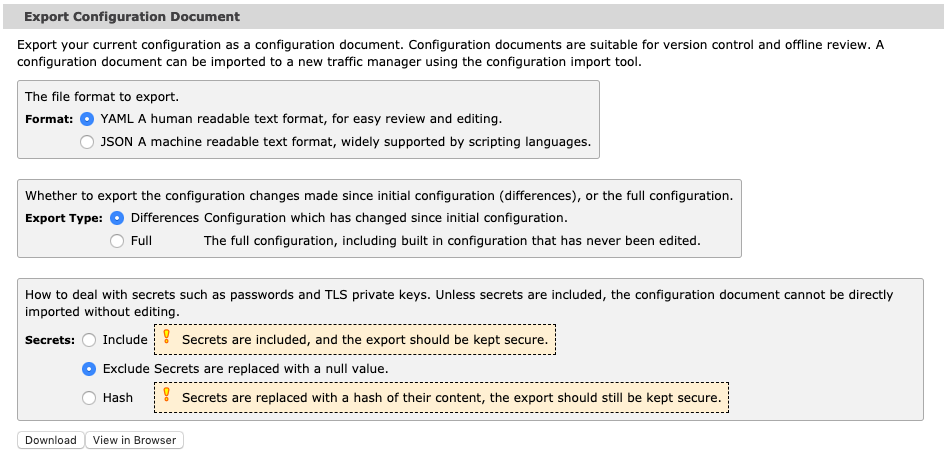

Pulse Secure Virtual Traffic Manager Helm Basic Deployment Example
===

The following is an example of how to deploy [Pulse Secure vTM](../../../) into a Kubernetes cluster with a Helm chart; managing the configuration of the traffic manager outside the Helm chart.

Deploying a traffic manager this way can be useful for building up configuration using the Administration GUI and then exporting that configuration to embed in another Helm chart's values, for example.

Alternatively, you could manage the deployment of the traffic manager from the Helm chart and manage the configuration separately, such as from a version control system.

Prerequisites
---
The following example assumes you have already installed [Helm](https://helm.sh) and deployed its _tiller_ component into your Kubernetes cluster.

If you haven't already added the vTM Helm chart repository to your local Helm installation, do so now:

```sh
helm repo add pulsesecure-vadc/vtm https://pulse-vadc.github.io/kubernetes-vtm/charts/
```

You can also clone this repository to use the resources in the example:
```sh
git clone https://github.com/pulse-vadc/kubernetes-vtm.git
cd kubernetes-vtm/helm/examples/basic-deployment
```

Steps
---
The example will cover how to:
* Deploy a traffic manager
* Interactively configure it to manage traffic for an example application, using the accompanying files `example-application.yaml` and `example-vtm-service.yaml`
* Export the vTM configuration as a YAML file
* Adopt that exported configuration to make it persistent, through one of two mechanisms:
  * Managing the configuration using Helm by saving the configuration into a values file
  * Saving the configuration into Kubernetes ConfigMaps that vTM will monitor for changes


Deploying a Traffic Manager
===
The following will deploy an unconfigured traffic manager using the default template parameters:

```
helm upgrade --install my-vtm-deployment --set eula=accept pulsesecure-vadc/vtm
```

Building Configuration
===
You should now have a single traffic manager instance deployed on which you can build up the configuration necessary to load-balance other applications. You can then export the configuration from the traffic manager and maintain it in a version control system.

> Note that configuration changes made directly in the Administration GUI will not be persisted if the traffic manager pod is terminated. Follow the example through to see how configuration that is built can be persisted.

In this example, vTM will be used to manage traffic to an application by placing it between the clients and the application pods. To do so, the following will be configured:

* A Kubernetes service that defines the application servers, allowing vTM to access them directly
* A vTM service, defining the front-end service endpoint on the traffic manager, and configuring it to route traffic onwards to the application servers
* A new Kubernetes service for client ingress traffic, providing access to the traffic-managed service endpoint on the vTM

Accessing the Administration GUI
---
Helm will print out a set of commands you can run that print a URL to access the Administration GUI:

```sh
Access admin interfaces through the my-vtm-deployment-admin service:
  export WEBUI_NODE_PORT=$(kubectl get services -o jsonpath="{.spec.ports[0].nodePort}" my-vtm-deployment-admin)
  export RESTAPI_NODE_PORT=$(kubectl get services -o jsonpath="{.spec.ports[1].nodePort}" my-vtm-deployment-admin)
  export NODE_IP=$(kubectl get nodes -o jsonpath="{.items[0].status.addresses[1].address}")

  echo "Visit https://$NODE_IP:$WEBUI_NODE_PORT to access the vTM Web UI"
  echo "Visit https://$NODE_IP:$RESTAPI_NODE_PORT to access the vTM Rest API"
```

A randomly generated password will be printed to the container logs of the deployed traffic manager. You can use the following command to print the logs of the vTM container:
```sh
kubectl logs --selector=app.kubernetes.io/instance=my-vtm-deployment,app.kubernetes.io/name=vtm
```

Visit the Administration GUI URL and use the username `admin` and the password printed to the logs to access the UI.

Load-balancing an Existing Application
---
If you already have an application deployed in Kubernetes, the recommended way to expose the application to the traffic manager is to create a [headless service](https://kubernetes.io/docs/concepts/services-networking/service/#headless-services) that defines and exposes the endpoints of your application and use vTM's Service Discovery functionality to obtain those endpoints from the Kubernetes DNS service.

> Note that the vTM Helm chart can automatically create the required Service Discovery configuration for load-balancing an existing headless application - see the [config-in-chart](../config-in-chart) example for details.

The following example defines a headless service for an application named 'my-application' - you can tailor this to match your own application and deploy it into the cluster:
```yaml
apiVersion: v1
kind: Service
metadata:
  labels:
    app: my-application
  name: my-application-lb-service
spec:
  ports: # Adjust as necessary
  - name: http
    port: 80
    protocol: TCP
    targetPort: 80
  selector:
    # Replace with selector for your application
    app: my-application
  clusterIP: None
```

Alternatively, you can apply the [example-application.yaml](./example-application.yaml) file to deploy a sample application and corresponding headless service:
```
kubectl apply -f ./example-application.yaml
```

> Note that other service discovery mechanisms can be employed to discover the application endpoints as necessary. vTM has a fully customizable service discovery plugin system. If your service discovery plugin requires access to the Kubernetes API, be sure to give the traffic manager the appropriate RBAC permissions to access the relevant API endpoints.

At this point you should have a Kubernetes service that defines the endpoints for your application servers, allowing vTM to access them directly.

Create a vTM Service
---
In this section, the vTM Service is defined. The vTM service defines a new 'front-end' traffic-managed service endpoint on the traffic manager, and configures it to route traffic onwards to the application servers.

In the traffic manager, a "Pool" object represents the application servers, and a "Virtual Server" object represents the front-end service endpoint.

Start by creating a Pool object:

From the Administration GUI, create a new Pool from the `Services > Pools` page with the following properties:
 * Name it `my-application-lb-service`
 * Select a Pool Type of `Dynamic`
 * Select the `Service Discovery Plugin` method of discoving nodes
 * Choose the `BuiltIn-DNS_Stateless` plugin from the drop-down list
 * Tell the plugin to query for the headless service created above by setting the paramters to the plugin to `--servicename=my-application-lb-service`
 * Choose a monitor for the pool, such as `Simple HTTP`




The pool's main settings page should show that the traffic manager has discovered the endpoints for the current set of pods running the application.

Next, create a virtual server to issue traffic to the pool from the `Services > Virtual Server` page:
 * Name it `my-application-vs`
 * Set the protocol to `http`
 * Set the port to `80`
 * Set the default traffic pool to `my-application-lb-service`



Finally, enable the service from the main index page of the UI:



Traffic issued to container port 80 will now be load-balanced across your application pods.


Create a Kubernetes Service
---
The last configuration step is to create a Kubernetes service for the front-end so ingress traffic can reach the traffic manager.

> If running in host networking mode, this step is not necessary - see the [host-networking example](../host-networking) for more detail.

The following manifest creates a NodePort service that listens on port 30080 and will allow traffic to reach the traffic manager pods:

```yaml
apiVersion: v1
kind: Service
metadata:
  labels:
    app: my-application
  name: my-application-vtm-service
spec:
  type: NodePort
  ports:
  - name: http
    port: 80
    nodePort: 30080
    protocol: TCP
    targetPort: 80
  selector:
    app.kubernetes.io/name: vtm
    app.kubernetes.io/instance: my-vtm-deployment
```

You can apply this from the example directory:
```sh
kubectl apply -f example-vtm-service.yaml
```

You should now be able to access your application from the created NodePort service:

```sh
curl $NODE_IP:30080
```

Export Configuration
---
You can now make any additional changes necessary to the traffic manager to support delivering your application.

When configuration of the traffic manager is complete, you can export the setup as a YAML file. The configuration can then be maintained with the Helm chart, or stored in version control and pushed into the Kubernetes cluster when it is updated.

To export the configuration, go to the `Services > Config Summary` page and, from the `Export Configuration Document` section, choose to export the configuration differences as a YAML file. As there are no secrets in the configuration yet, the option to include, exclude, or hash secret information has no effect.



> See the [config-in-chart](../config-in-chart) example for how to manage secrets.

The exported configuration can be used either directly in a Helm chart values.yaml file, or applied to a ConfigMap, to make it permanent.


Persisting Configuration
===
The following sections describe two alternative ways of making the traffic manager configuration persistent:
* Managing the configuration using Helm by saving the configuration into a values file
* Saving the configuration into Kubernetes ConfigMaps that vTM will monitor for changes

Managing Configuration with Helm
---
The exported configuration can be used directly in a values.yaml file supplied when deploying the traffic manager.

The [values-with-config.yaml](./values-with-config.yaml) file shows the configuration created in the example stored in the vTM values.yaml file, with an extra TrafficScript rule added to it.

The permanent configuration can be applied using a helm upgrade command (add `--install` if creating a new deployment):
```
helm upgrade my-vtm-deployment --set eula=accept -f ./values-with-config.yaml pulsesecure-vadc/vtm
```

When the change to the configuration has been propagated to the traffic manager (this can take up to a minute), application traffic will now be modified by the rule. Note the `X-Powered-By` header in the response:

```sh
$ curl -IXGET $NODE_IP:30080
HTTP/1.1 200 OK
Server: nginx/1.7.9
Content-Type: text/html
Accept-Ranges: bytes
ETag: "54999765-264"
Connection: keep-alive
Last-Modified: Tue, 23 Dec 2014 16:25:09 GMT
X-Powered-By: Pulse Secure vTM
Content-Length: 612
```

The new supplied configuration will be picked up automatically by any other traffic managers created as part of the same deployment.

Changes to configuration and the number of vTM replicas can all now be made through the values-with-config.yaml file and managed by helm.


<a name="configmaps" id="configmaps"></a>Managing Configuration with ConfigMaps Directly
---
An alternative method of maintaining the configuration is to store it directly in a ConfigMap that is not managed by Helm. The ConfigMap could be automatically generated from a version-controlled file by a tool such as [k8s-config-projector](https://github.com/tumblr/k8s-config-projector).

The [my-app-vtm-config.yaml](./my-app-vtm-config.yaml) manifest describes a ConfigMap that contains the configuration created in the example. It also imports an extra TrafficScript rule that is stored externally in the corresponding [my-app-vtm-data.yaml](./my-app-vtm-data.yaml) manifest.

> See the [Pulse Secure Virtual Traffic Manager Configuration Importer Guide](https://www.pulsesecure.net/techpubs/Pulse-vADC-Solutions/Pulse-Virtual-Traffic-Manager) for more detail on how to construct vTM configuration documents and have them reference data stored externally.

To update the existing deployment to use this configuration, create the ConfigMaps and then update the vTM deployment by supplying the `serviceConfigMounts` and `serviceDataMounts` values to the Helm chart (add `--install` to the `helm upgrade` command if creating a new deployment):
```
kubectl apply -f ./my-app-vtm-config.yaml
kubectl apply -f ./my-app-vtm-data.yaml
helm upgrade my-vtm-deployment --set eula=accept --set serviceConfigMounts[0].name=my-application-vtm-config --set serviceDataMounts[0].name=my-application-vtm-data pulsesecure-vadc/vtm
```

When the configuration takes effect, the service should return the `X-Powered-By` header:
```sh
$ curl -IXGET $NODE_IP:30080
HTTP/1.1 200 OK
Server: nginx/1.7.9
Content-Type: text/html
Accept-Ranges: bytes
ETag: "54999765-264"
Connection: keep-alive
Last-Modified: Tue, 23 Dec 2014 16:25:09 GMT
X-Powered-By: Pulse Secure vTM, configured by the my-application-vtm-config ConfigMap
Content-Length: 612
```

Any changes to the data in the ConfigMaps will be picked up by all traffic managers that are part of the deployment.